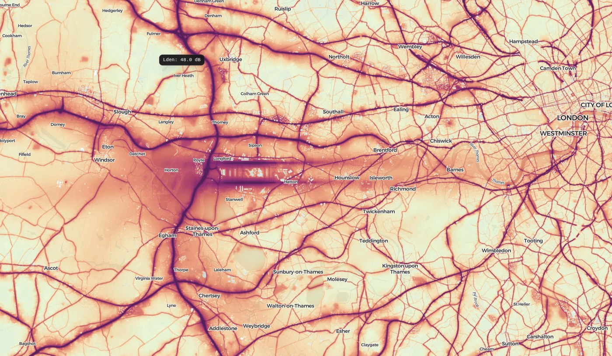
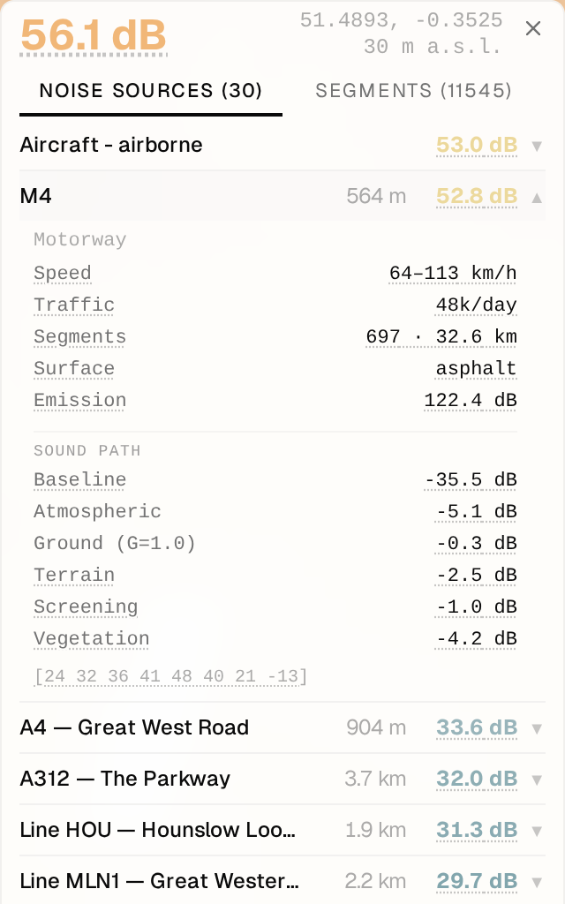
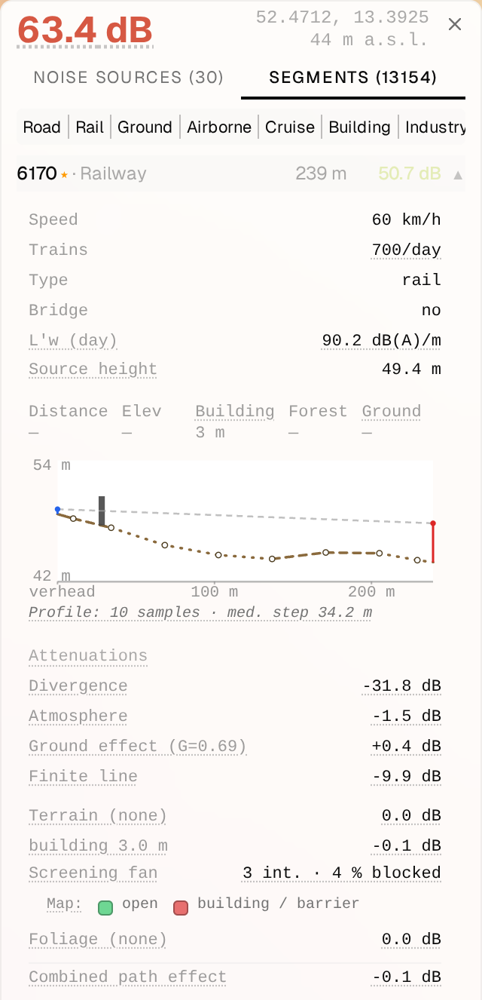

## Mission

**Make noise visible. Make quiet possible.**

quietmap.org shows how loud the world really is — and helps you find the quiet.

1. **Find quiet places** — search any address, explore the map, discover where to live, work, or relax without noise
2. **Understand noise** — see which sources contribute (roads, railways, aircraft, industry) and how terrain, buildings, and forests reduce it
3. **Build a comparable record** — each published dataset generation is frozen, so later generations can be compared honestly

Human-made noise is not the same as natural sound. A forest at 50 dB with birdsong feels quiet. A road at 50 dB with traffic feels loud. quietmap.org measures environmental noise from human sources — transport, industry, and urban activity — not nature.

## How the map works

Three steps:

1. **Sources emit noise.** Roads, trains, planes, factories and buildings — each modelled from real data: traffic counts, flight tracks, registries.
2. **Sound travels and fades.** Hills block it, buildings screen it, forests absorb it — simulated with ISO 9613-2 physics.
3. **You see the result** on a ~12-meter raster, from pale (quiet) through yellow and orange to deep purple (80+ dB).

Each of the five source layers — roads, railways, aircraft, industrial, buildings — is modelled independently and toggles on its own in the map.



→ **[Read the full methodology](/about/methodology)** — source layers, propagation,
the standards they use, known limits, and validation against real measurements.

## Click anywhere

Every point on the map can explain itself. Click, and a panel shows the total Lden at that spot with two views:

**Noise sources** groups everything audible there the way you'd name it — a road as one row, a factory, "aircraft — airborne" — sorted by how much each contributes. Open a row and you see the source's data (speed, traffic and vehicle mix, surface, trains per day…) and its **sound path** to your point: how much the distance, air, ground, terrain, buildings and vegetation each took off, in dB. Underlined terms explain themselves on hover; aircraft rows link to the actual flight traces.

**Segments** is the raw computation: the individual pieces the model actually sums — a few dozen meters of road each, single flights, single buildings. Filter by kind, open any piece, and you get its emission inputs, a terrain profile of the exact path from that piece to your point (elevation, buildings, forest, ground hardness), the attenuation table, day/evening/night levels — and what-if toggles: what would this be with no terrain in the way, no vegetation, free field?

<p>


</p>

Nothing on the map is a black box — if a number surprises you, two clicks show where it came from.

## Data and enrichment

The map combines OpenStreetMap geometry with public traffic, rail, flight, building,
terrain, land-cover, and industrial-registry data. Local measurements and registries
override class defaults where they exist; otherwise a source inherits a documented
default for its class. Matching is class-aware: a motorway count does not become a
residential-street count, and a tram timetable does not become a mainline estimate.

The [methodology](/about/methodology) explains the model and its limits. Country pages
describe local sources and gaps; use the region list below to explore them.

<!-- REGION_CHILDREN -->

## Dataset generations

The public map is published as a frozen worldwide dataset generation. Each generation
combines a planet extract, flight observations, and the latest available public
traffic and registry data at build time. Source coverage changes by country and layer;
the country pages record important exceptions. Once multiple generations are published,
their frozen inputs will make comparison possible without pretending that every source
was measured on the same day.

## What you see on the map

### The noise indicator: Lden

The map shows **Lden** (day-evening-night level), the European standard from [END 2002/49/EC](https://eur-lex.europa.eu/eli/dir/2002/49/oj/eng). It weights evening noise +5 dB and night noise +10 dB to reflect the greater annoyance of noise during rest periods:

```
Lden = 10 × log₁₀((12 × 10^(Ld/10) + 4 × 10^((Le+5)/10) + 8 × 10^((Ln+10)/10)) / 24)
```

Day: 07:00–19:00, evening: 19:00–23:00, night: 23:00–07:00.

[WHO 2018 guidelines](https://www.who.int/europe/publications/i/item/9789289053563) recommend: road < 53 dB, rail < 54 dB, aircraft < 45 dB Lden.

### Grid

A Web-Mercator raster at zoom 12 (512-pixel tiles, ~12 m per pixel at 50°N, varies with latitude) — fine enough to distinguish the street-facing vs garden side of a building. A zoom pyramid (z2–12) serves coarser tiles when zoomed out; selected areas can publish z13 detail at half the pixel spacing.

### Color scale

The colors are not ours. They come from Beate Tomio (Weninger), ["A Color Scheme for the Presentation of Sound Immission in Maps"](https://www.researchgate.net/publication/280488890_A_color_scheme_for_the_presentation_of_sound_immission_in_maps), EuroNoise 2015 — a scheme tested with 232 respondents — as published in its current revision **v5.b (eleven classes, 30–80 dB)** on [coloringnoise.com](https://www.coloringnoise.com/theoretical_background/new-color-scheme/) (licensed CC BY-NC-ND 4.0). We use the class colors unmodified, hex for hex, dB boundary for dB boundary.

Below 30 dB the map is transparent (the scheme's "no color"); 80 dB is the terminal shade, held flat above it rather than inventing a darker one. Colors interpolate smoothly between rows — a cell at 62 dB gets a blended shade between the 60 and 65 dB rows, never a hard jump. Opacity is our rendering adaptation, not part of the scheme: the paper is opaque, but we overlay a legible basemap, so alpha rises with dB — the paper's own "louder = more salient" intent, executed via alpha.

| Lden | Swatch | Hex | Opacity |
|------|--------|-----|---------|
| < 30 dB | — | — | 0% — not shown |
| 30 dB | <span style="display:inline-block;width:12px;height:12px;border-radius:3px;vertical-align:middle;border:1px solid rgba(0,0,0,.15);background:#82A6AD"></span> | `#82A6AD` | 40% |
| 35 dB | <span style="display:inline-block;width:12px;height:12px;border-radius:3px;vertical-align:middle;border:1px solid rgba(0,0,0,.15);background:#A0BABF"></span> | `#A0BABF` | 45% |
| 40 dB | <span style="display:inline-block;width:12px;height:12px;border-radius:3px;vertical-align:middle;border:1px solid rgba(0,0,0,.15);background:#B8D6D1"></span> | `#B8D6D1` | 50% |
| 45 dB | <span style="display:inline-block;width:12px;height:12px;border-radius:3px;vertical-align:middle;border:1px solid rgba(0,0,0,.15);background:#CEE4CC"></span> | `#CEE4CC` | 55% |
| 50 dB | <span style="display:inline-block;width:12px;height:12px;border-radius:3px;vertical-align:middle;border:1px solid rgba(0,0,0,.15);background:#E2F2BF"></span> | `#E2F2BF` | 60% |
| 55 dB | <span style="display:inline-block;width:12px;height:12px;border-radius:3px;vertical-align:middle;border:1px solid rgba(0,0,0,.15);background:#F3C683"></span> | `#F3C683` | 65% |
| 60 dB | <span style="display:inline-block;width:12px;height:12px;border-radius:3px;vertical-align:middle;border:1px solid rgba(0,0,0,.15);background:#E87E4D"></span> | `#E87E4D` | 70% |
| 65 dB | <span style="display:inline-block;width:12px;height:12px;border-radius:3px;vertical-align:middle;border:1px solid rgba(0,0,0,.15);background:#CD463E"></span> | `#CD463E` | 75% |
| 70 dB | <span style="display:inline-block;width:12px;height:12px;border-radius:3px;vertical-align:middle;border:1px solid rgba(0,0,0,.15);background:#A11A4D"></span> | `#A11A4D` | 80% |
| 75 dB | <span style="display:inline-block;width:12px;height:12px;border-radius:3px;vertical-align:middle;border:1px solid rgba(0,0,0,.15);background:#75085C"></span> | `#75085C` | 85% |
| 80+ dB | <span style="display:inline-block;width:12px;height:12px;border-radius:3px;vertical-align:middle;border:1px solid rgba(0,0,0,.15);background:#430A4A"></span> | `#430A4A` | 90% |

### Toggles

- **Source layers:** Roads, Railways, Industrial, Buildings, and Aircraft (ground ops, airborne, cruise) — each toggleable independently
- **Overlays:** Quiet zones (areas below a threshold)

## Overlays

### Quiet zones

Shades every map pixel below a configurable noise threshold (default 35 dB, slider 20–45) green. Useful for identifying quiet retreats, parks, and areas suitable for noise-sensitive development.

## FAQ

**Is this measured or computed?**
Computed — a physics model (CNOSSOS-EU emission, ISO 9613-2 propagation) over public data. No microphone network could cover the planet at 12-meter resolution. The model is continuously checked against real monitoring stations; see [Validation](/about/methodology).

**How accurate is it?**
It's an engineering estimate, not a certificate. A gap against a measurement or official map is first attributed to better input data, a justified methodology difference, or a model defect; only defects become fixes. For a single address, read the value as "around X dB" — and click the point to see exactly what the number is built from.

**Why does my quiet street show 50 dB?**
Click it. Most surprises have a visible cause: a road with no measured traffic falls back to class defaults, a nearby factory is classified by registry sector, or the dominant source is something you've tuned out. If the inputs are genuinely wrong for your street, [tell us](mailto:info@quietmap.org) — reports with an address are how the map gets better.

**Why are there no low-flying aircraft where I live?**
The aircraft layer sees what volunteer ADS-B receivers see. Where no feeder is nearby, low-altitude flights aren't received and only high-altitude cruise noise (~20 dB) appears — a limit of the data source, not the model. Hosting a receiver in a blank spot fixes it for everyone.

**Why does the map show nothing below 30 dB?**
By design: the [color scheme](#color-scale) marks under 30 dB as "no color" — genuinely quiet. To hunt for the quietest places, use the Quiet zones overlay, which shades everything under a threshold you pick (20–45 dB).

**Can I use screenshots or embed the map?**
Yes, free, with visible "quietmap.org" attribution — details in [credits & terms](/about/credits).

## Help us make it better

**See something wrong on your street?** Write to [info@quietmap.org](mailto:info@quietmap.org) with the address. Every confirmed report feeds the validation loop — real-world corrections are the most valuable data we get.

**Have data? We're looking for** (in order of impact):

1. **Road traffic from navigation apps** — per-street average counts of cars / trucks / motorcycles by time of day, at Waze / Google Maps / TomTom scale. This is the single biggest accuracy lever the map has.
2. **Commercial flight tracking** — denser coverage than the open feeds we use today (e.g. Flightradar24-grade data).
3. **Railway traffic** — timetables and passenger/freight train counts per line.
4. **Real noise measurements** — station exports, long-term campaigns, monitoring-network data anywhere in the world. These feed the validation loop directly: every honest measurement makes the model demonstrably better.
5. **Better national data for any country** — traffic censuses, facility registries, turbine inventories.
6. **Shipping** — vessel traffic and port operations, for a future marine layer.

If you work somewhere that has this data — or know who does — [we'd love to talk](mailto:info@quietmap.org).

## Who builds this

quietmap.org is an internal project of [Miton](https://www.miton.cz/en/).

The [product code is open source](https://github.com/vondra/quietmap), and the computations are transparent and reproducible from public data.

## Credits & terms

→ **[Data credits, usage terms & privacy](/about/credits)**

## Contact & status

- **Email:** [info@quietmap.org](mailto:info@quietmap.org)
- **Service status:** [status.quietmap.org](https://status.quietmap.org) — live uptime of the map and tiles
